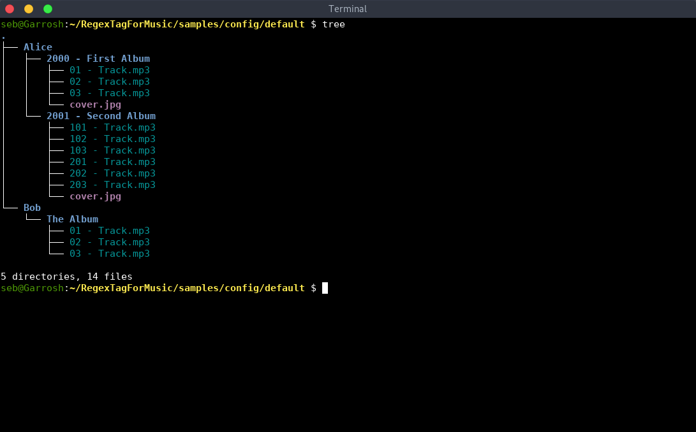
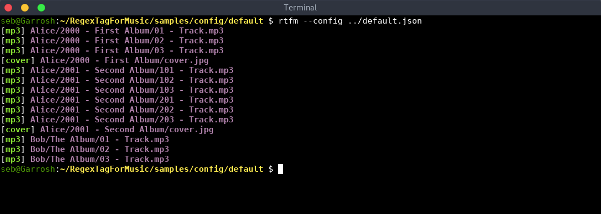
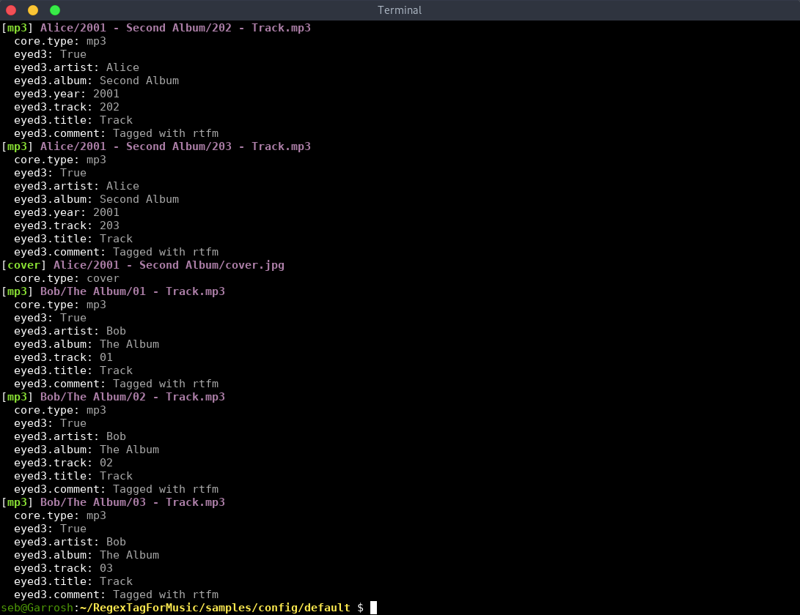
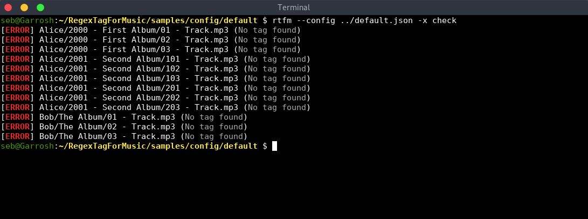
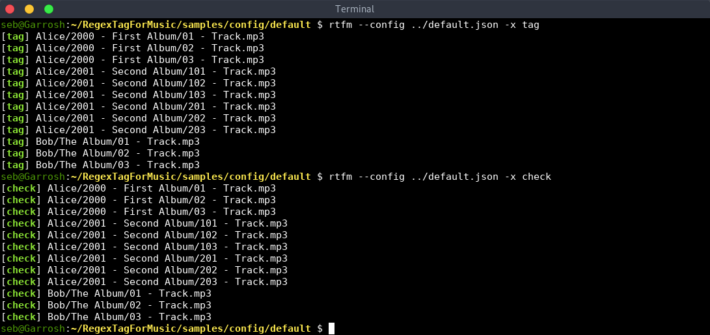
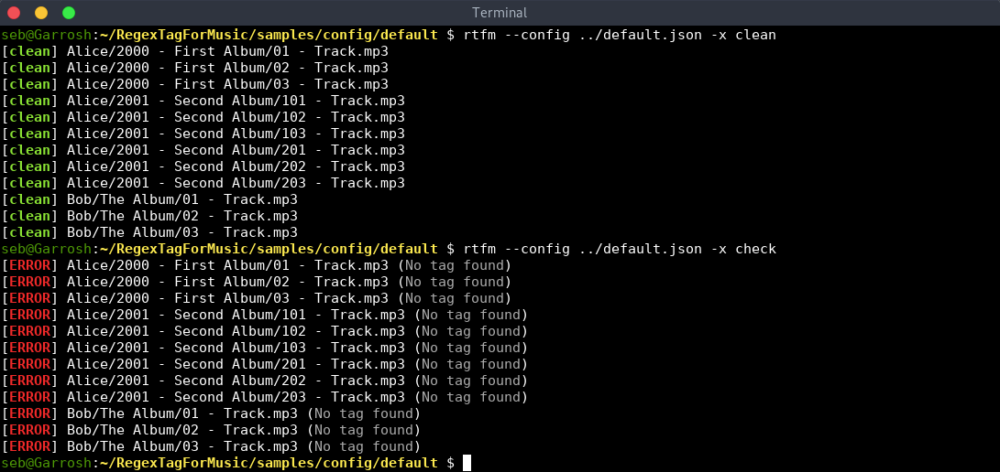

[](https://travis-ci.org/essembeh/RegexTagForMusic)


# RegexTagForMusic

RegexTagForMusic is a tool to tag *mp3* files using *regular expressions* to extract *ID3 tags* the the file path. In other words, if the path matches a regex, you can use any matching group as *ID3 tag*.


I originally developed *RegexTagForMusic* to automatize tagging my music using [eyeD3](http://eyed3.nicfit.net/). ID3 tags are some metadata just like the way you store your files on your filesystem so I wanted a way to synchronize tags *from* the filesystem:
- the *album field* is the parent folder of the file
- the *artist field* is the parent folder of the *album* folder
- the *tracknumber field* is the first digit of the filename
- the *title field* is the rest of the filename


# Install

You can install *RegexTagForMusic* directly from [PyPI](https://pypi.org/project/RegexTagForMusic/) using pip:

```sh
# Ensure pip is installed on the system
$ sudo apt install python3-pip
# You can install just for the current user
$ pip install --user RegexTagForMusic
# Or install it for all users
$ sudo pip install RegexTagForMusic
```

You can also build *RegexTagForMusic* from the sources:
```sh
$ git clone https://github.com/essembeh/RegexTagForMusic
$ cd RegexTagForMusic
$ make
$ pip install --user dist/RegexTagForMusic-*.whl
```

# Try it

See [the default configuration file](samples/config/default.json) and [samples documentation](SAMPLES.md).
```sh
$ cd samples/config/default
$ tree
```



Now verify that all the files are recognized using the filters from the configuration file:
```sh
$ rtfm --config ../default.json
```



Also check all the properties declared in the filters:
```sh
$ rtfm --config ../default.json --verbose
```



The command `check` verifies that the existing tags in the mp3 files are matching the properties extracted from the file path:
```sh
$ rtfm --config ../default.json -x check
```



In our example, the files are not tagged yet, so le's tag them:
```sh
$ rtfm --config ../default.json -x tag
```



The `clean` action removes all the tags present in the files:
```sh
$ rtfm --config ../default.json -x clean
```



# Command line options and arguments

```
$ rtfm --help
usage: rtfm [-h] [-v] [-c CONFIG] [-l LIBRARY] [-r ROOT] [--folders]
            [-x ACTION] [-n] [--continue]
            [FILE [FILE ...]]

Simple hello world python sample

positional arguments:
  FILE                  files to process

optional arguments:
  -h, --help            show this help message and exit
  -v, --verbose         be more verbose
  -c CONFIG, --config CONFIG
                        configuration file (default:
                        ~/.config/rtfm.json
  -l LIBRARY, --library LIBRARY
                        library file
  -r ROOT, --root ROOT  make all paths relative to given folder (default is
                        current folder, $PWD)
  --folders             also process folders
  -x ACTION, --execute ACTION
                        action to perform
  -n, --dryrun          dryrun mode, do not modify files
  --continue            continue in case of error
```

# Configuration file

See [sample configuration files](samples/config/) and [samples documentation](SAMPLES.md)
